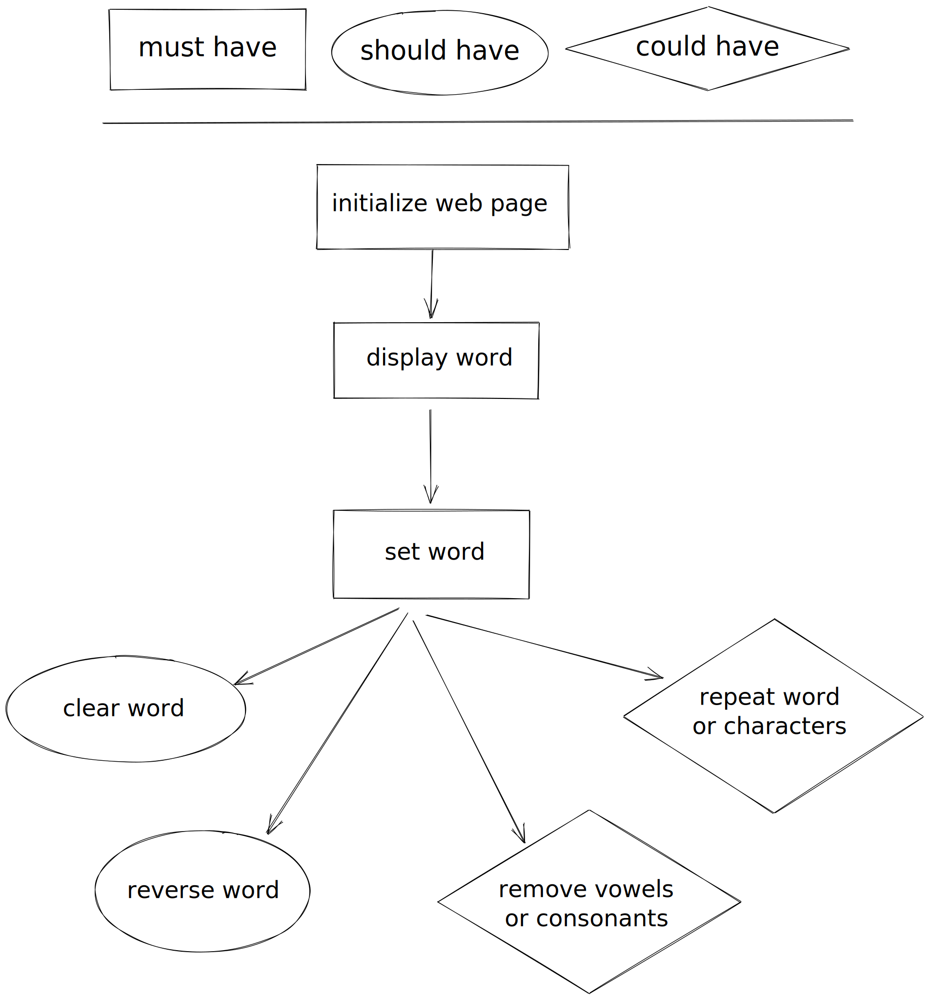
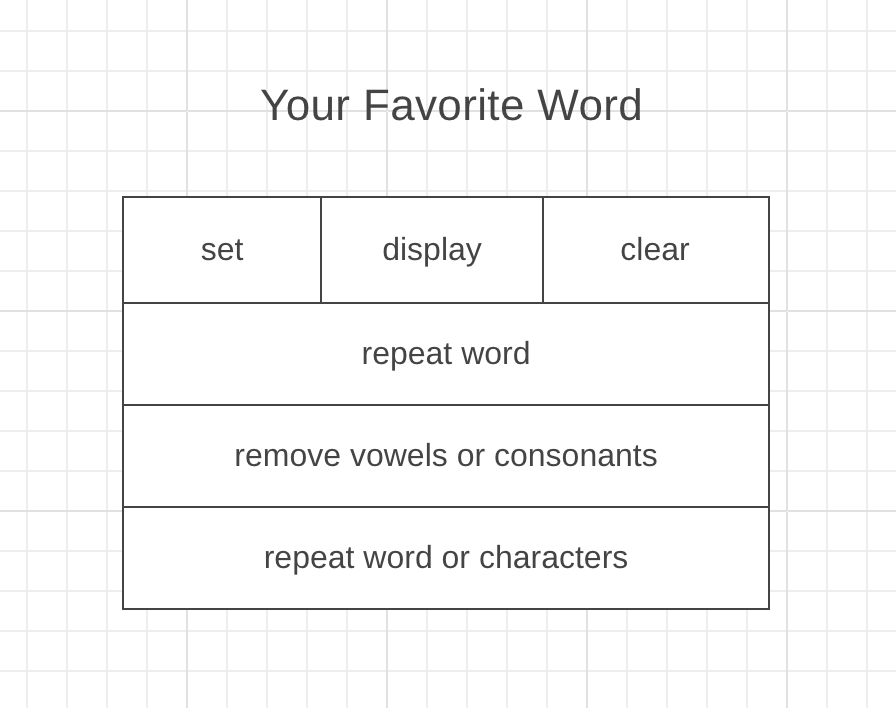

# Favorite Word

A program to let users save and modify their favorite word. Each JavaScript file is developed on a separate branch.

---

## User Story Dependencies

---

## WIREFRAME

---

## 0. Setup

- [ ] Create repo
- [ ] Add Contributors
- [ ] Set up Project Board
- [ ] Start README
- [ ] Turn on GitHub Pages

---

## 1. Initialize Application

> complete

As a user I want to open the web page so that I can use it

- [ ] _Given any browser when a user navigates to our URL then the site should appear with no errors_

### HTML

- require styles
- require evaluation buttons script
- develop and style the buttons

### CSS

- styling for the buttons

[TOP](#favorite-word)

---

## 2. Display Word

> complete

As a user I want to display the saved word

- [ ] _Given the word is not empty, when a user clicks the button the word will be displayed along with a friendly message_
- [ ] _Given the word is empty, when a user clicks the button they will be told there is no saved word_

### HTML

- button to display word with `onclick` to call the interaction
- script tag for `data.js`
- script tag for `prompts/enter-word.js`
- script tag for `interactions/set-word.js`

### `data.js`

- a `favoriteWord` variable initialized to an empty string, used to store the user's favorite word

### Renders

- `describe-word.js`: renders a word and a description of the word into a full message

### Interactions

- `display-word.js`: an interaction function that renders the saved favorite word and alerts the description
  - uses: `favoriteWord`, `describe-word.js`

[TOP](#favorite-word)

---

## 3. Set Word

As a user I want to set my favorite word

- [ ] _Given the word is empty, when a user clicks the button they will be prompted for a new favorite word. after the word is saved it will be displayed_
- [ ] _Given there is a saved word, when a user clicks the button they will need to confirm replacing the saved word before being prompted to enter a new one. after the word is saved it will be displayed_

### HTML

- button to set word with `onclick` to call the interaction
- script tag for `prompts/enter-word.js`
- script tag for `interactions/set-word.js`

### Prompts

- `enter-word.js`: prompts to user to enter a word. In this app a word is anything containing only letters or hyphens.

### Interactions

- `set-word.js`: prompt the user to enter a word, then save the new value to the data variable. finally display the new word to the user
  - uses: `favoriteWord`, `enter-word.js`, `display-word.js`

[TOP](#favorite-word)

---

## 4. Clear Word

As a user I want to be clear the saved word so I can start over

- [ ] _Given there is **not** a saved word, when a user clicks the button they will be alerted that there was nothing to clear_
- [ ] _Given there is a saved word, when a user clicks the button they will be asked to confirm clearing the word_

### HTML

- button to clear word with `onclick` to call the interaction
- script tag for `interactions/clear-word.js`

### Interactions

- `clear-word.js`: asks the user to confirm that they want to clear the word, then resets the data variable to an empty string if they confirm. let the user know that the word was successfully cleared.
  - uses: `favoriteWord`, `display-word.js`

[TOP](#favorite-word)

---

## 5. Reverse Word

As a user I want to reverse my favorite word so that I can see it backwards

- [ ] _Given there is **not** a saved word, when a user clicks this button they will be told there is nothing to reverse_
- [ ] _Given there is a saved word, when a user clicks the button they will be asked to confirm they want to reverse the word. after the word is reversed it will be displayed. the reversed word is not saved_

### HTML

- button to reverse word with `onclick` to call the interaction
- script tag for `logic/reverse-string.js`
- script tag for `renders/before-and-after.js`
- script tag for `interactions/reverse-word.js`

### Logic

- `repeat-string.js`: repeats a string a given number of times

### Renders

- `before-and-after.js`: render two strings, one from before and one from after a change.

### Interactions

- `reverse-word.js`: asks to user to confirm they want to reverse their word, if the user cancels exit the interaction. if they confirm, reverse the word and reassign the data variable, then display the new value.
  - uses: `favoriteWord`, `display-word.js`, `reverse-string.js`, `before-and-after.js`

[TOP](#favorite-word)

---

## 6. Remove Vowels or Consonants

As a user I want to either remove all the vowels or all the consonants from my word so it is harder to read.

- [ ] _Given there is **not** a saved word, when a user clicks this button they will be told there is no word._
- [ ] _Given there is a saved word, when a user clicks this button they will be asked to choose between removing all vowels or all consonants. after the word has been updated it will be displayed_

### HTML

- button to remove vowels or consonants with `onclick` to call the interaction
- script tag for `prompts/choose-from-options.js`
- script tag for `logic/remove-characters.js`
- script tag for `interactions/remove-vowels-or-consonants.js`

### Prompts

- `choose-from-options.js`: given a message and an array of strings, prompt the user to enter something until they enter one of the array's values. returns this value.

### Logic

- `remove-characters.js`: removes all occurrences of the given characters from a string

### Interactions

- `remove-vowels-or-consonants.js`: prompt the user to select either "vowels" or "consonants", then displays the word without the selected type of character.
  - uses: `favoriteWord`, `display-word.js`, `choose-from-options.js`, `remove-characters.js`, `before-and-after.js`

[TOP](#favorite-word)

---

## 7. Repeat Word or Characters

As a user I want to either repeat my whole word, or each character in the word so that there is more of my favorite word.

- [ ] _Given there is **not** a saved word, when a user clicks this button they will be told there is no word._
- [ ] _Given there is a saved word, when a user clicks this button they will be asked to choose between repeating the entire word or each character in the word. after the word is updated it will be displayed_

### HTML

- button to repeat word or characters with `onclick` to call the interaction
- script tag for `logic/repeat-string.js`
- script tag for `logic/repeat-characters.js`
- script tag for `interactions/repeat-string-or-characters.js`

### Prompts

- `enter-number.js`: prompts the user to enter a number

### Logic

- `repeat-string.js`: repeats a whole string a given number of times
- `repeat-characters.js`: repeats each character in a string a given number of times

### Interactions

- `repeat-string-or-characters.js`: prompt the user to select either "entire word" or "each character", then displays the string with repetitions.
  - uses: `favoriteWord`, `display-word.js`, `choose-from-options.js`, `enter-number.js`, `repeat-string.js`, `repeat-characters.js`, `before-and-after.js`

[TOP](#favorite-word)
